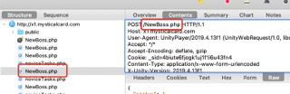

## 这里是 **蜡烛** 的 *魔卡幻想游戏* 自动化脚本工具

# 这个该怎么用
## charles

这个需要配合**charles**一起使用

[charles使用教程1](https://blog.csdn.net/lmmilove/article/details/50244537)

[charles使用教程2](https://www.jianshu.com/p/fc2f0afa8b56)

此处就不详细讲解charles具体的安装与使用。

一般设置整个域名做为断点。

### 一般操作

进行完游戏操作之后，在charles中获取到相应请求的数据，并且复制进代码之后，使用命令行进行重复性游戏行为

### 一般xx操作

在要进行xx操作的时候，在charles中开启断点，然后进行操作，关闭断点，拿取相应请求的数据并且复制进代码中之后，abort相关请求。 然后使用命令行进行xx游戏行为

### 其他操作

#### 莉莉丝
一般只在刷莉莉丝时需要开启 **Map Remote** 功能，进行快速刷莉莉丝。

刷莉莉丝，最好还是去淘宝找人代刷。这边刷莉莉丝需要一定的代码技术功底。

### 关键数据

#### host

如图 http://x1.mysticalcard.com 即是host，在此运行环境中，一般取 **x1.mysticalcard.com**

#### path

如图 /xxx.php 即是 **path**

#### Cookie

如图中 _sid=xxxxxxxxx 即是Cookie，在此运行环境中，仅取_sid=后面的数据，即xxxxxxx

#### data/body

如图中 很长的一串文本 即为 data 或 body

***
以上就是所有关于charles的介绍。下面的文档几乎不涉及charles。

## 关于代码

**以下有何不懂，尽可能百度相关关键词**

### 如何使用这个代码

安装 [nodejs](https://nodejs.org/zh-cn/)

安装 [vscode](https://code.visualstudio.com/)，在vscode里面打开这个文件夹。

打开basicOptions.json文件，一般游戏请求相关数据都在这边修改。

打开vscode的**命令行**，键入相关命令，即可愉快玩游戏。

### 关于**basicOptions**文件

这里面基本上都是一些基本的设置。

一般需要手动改的就是

1. host
2. path
3. Cookie
4. round
5. data
6. shuatuTotalRound

不常用到的
1. onebyonePath
2. onebyoneData
3. onebyoneRound
4. onebyoneS_Path
5. onebyoneS_Data
6. onebyoneS_SingleRound
7. onebyoneS_Round

#### host
host是域名

一般来说 传承一就是 *x1.mysticalcard.com*，s1 就是 *s1.mysticalcard.com*

#### path
path是路径，一般也可以当作是模块

比如常用的：

/*.php

* user - 用户相关，买体力，领礼物箱
* medition - 符文相关
* equip - 装备相关
* activitydaily - 每日任务
* shop - 商店
* contract - 契约
* mapstage - 刷图
* mapstagehard - 刷噩梦图
* NewBoss - 肆虐
* maze - 迷宫

等等。

一般path都是在charles上找到

#### Cookie
cookie是用户登录信息。

一般是在charles里面找到。

#### round
round是跑多少次。

一般不要超过90次。

超过100次肯定会系统拒绝你的ip访问几分钟。

如果是战斗的话，不要超过50次。次数多了会让系统宕机重启。

#### data
data是请求数据

一般是在charles里面找到。即 body/content/raw

### 重中之重

在进行之后描述的操作前，一定要确保自己已经修改了 **host、path、Cookie、data**

在进行之后描述的操作前，一定要确保自己已经修改了 **host、path、Cookie、data**

在进行之后描述的操作前，一定要确保自己已经修改了 **host、path、Cookie、data**

### 命令行

请**自行百度**vscode的**命令行**怎么打开。

**一定要安装nodejs**

所有命令行在**package.json**中有写，常用的有
* node run test
* node run shuatu
* node run tili
* node run obo
* node run obos

在命令行内输入之后按回车即可运行

#### test
test是一般运行

#### shuatu
shuatu是刷图

#### tili
tili是买一次体力

#### obo
obo是 one by one，即一次运行之后运行下一次

#### obos
obos是 ones by ones，即多次运行之后继续下一轮多次运行

# Warning

🈲️❌🚫

不可用于洗练

不可用于云游商人兑换

不可用于领礼物箱时礼物箱内有契约【契约有概率会消失】

不可用于领礼物箱时礼物箱内有两个同样卡牌【大概率只能领到一张卡牌】